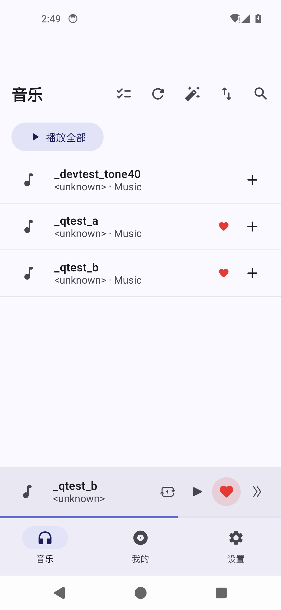
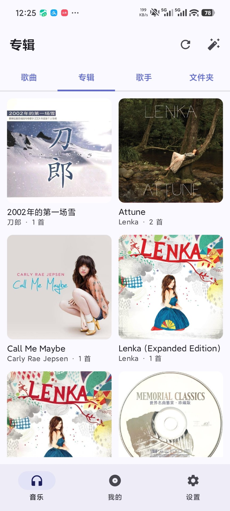
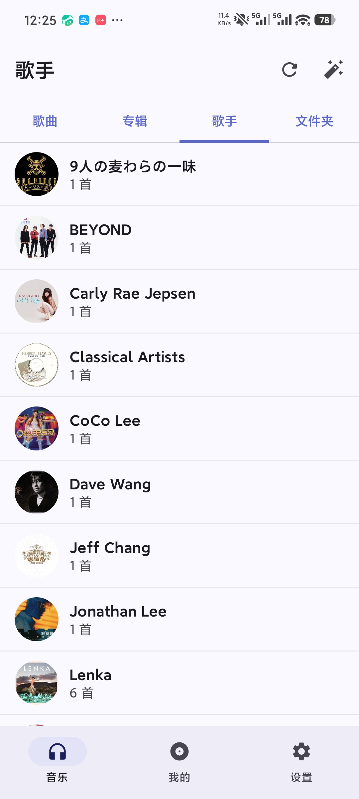
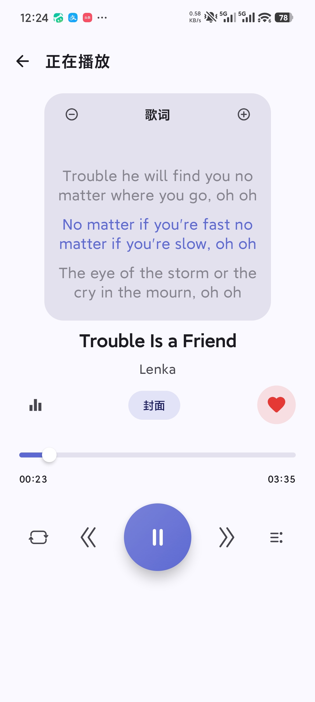
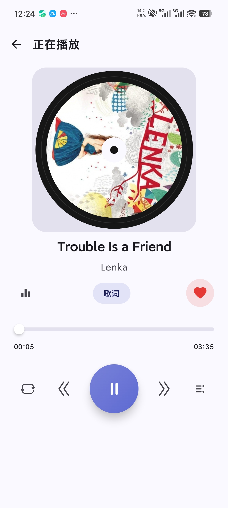
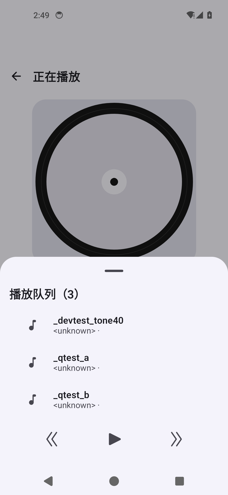
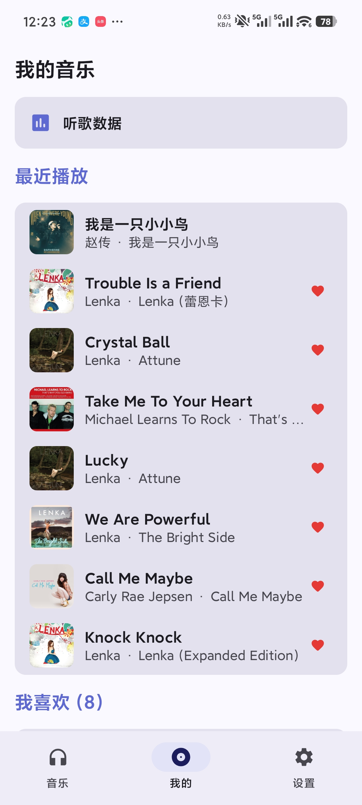
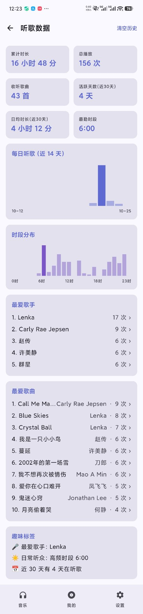
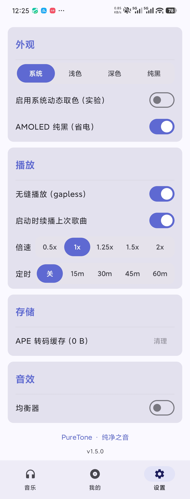

# PureTone 极简音乐播放器

> 一个基于 Jetpack Compose 的安卓本地音乐播放器，专注「好看、好听、轻量」。
> 自动扫描本地音乐，支持 3D 翻转歌词、APE/CUE 无损播放、联网补全元数据与歌词、均衡器、听歌统计等。

---

## 📸 界面预览

| 音乐库 · 歌曲 | 专辑网格 | 歌手列表 |
| --- | --- | --- |
|  |  |  |

| 播放页 · 歌词 | 播放页 · 封面 | 播放队列 |
| --- | --- | --- |
|  |  |  |

| 我的 | 听歌数据 | 设置 |
| --- | --- | --- |
|  |  |  |

---

## ✨ 功能特性

- **本地媒体扫描**：基于 `MediaStore` 自动扫描设备音乐，经 Room 持久化，支持按歌曲/专辑/歌手/文件夹多维浏览与排序。
- **音乐页四页签**：歌曲 / 专辑 / 歌手 / 文件夹一键切换；专辑页为方形封面**网格墙**，歌手为圆形头像列表，文件夹按目录聚合。
- **二级详情页**：专辑 / 歌手 / 文件夹均可进入详情页（封面 + 标题 + 首数 + 播放全部），列表项支持单击播放、长按操作菜单、加入歌单。
- **常驻迷你播放条**：仅保留「上一首 / 播放暂停 / 下一首」三枚按钮，左右对称，底部细进度线。
- **沉浸式播放页**
  - 封面 3D 翻转露出实时歌词；
  - 旋转 CD 唱盘；
  - 上滑/下滑手势切歌（tanh 阻尼视差过渡，松手过阈值续接归位）。
- **无损与冷门格式**：集成 ffmpeg-kit，支持 **APE / FLAC / WAV** 等格式，APE 在播放前自动转码为 WAV。
- **DLNA 投屏**：SSDP 自动发现局域网内的电视 / 音箱 / Hi-Fi 网播，选中即把本地曲目投过去由渲染器出声（本机同时暂停，避免两头同时响）。
  - MP3 / FLAC / WAV / M4A / AAC 原文件**直投**，秒开；
  - **APE 等渲染器解不了的格式**先在手机端转码为 WAV 再投（复用本地播放的转码缓存——已经播过的曲目再投无需等待，未播过的会显示「正在为投屏转码…」）；
  - 投屏中「播放 / 暂停 / 上一首 / 下一首 / 进度拖动」全部路由到渲染器（含通知栏、锁屏与桌面小部件三个入口），播放页显示的当前曲目与进度与电视一致；
  - 渲染器支持 Range，可在电视端拖动进度；投屏失败会回写原因并自动恢复本地播放。
- **歌词与元数据**
  - 内置歌词解析（LRC / 内嵌歌词）；
  - 联网补全元数据（iTunes 接口）与下载歌词（LRCLIB）。
- **播放控制**
  - 顺序 / 随机 / 单曲循环三态循环；
  - 下一首播放、加入队列；
  - 收藏（红心），跨列表/播放页/迷你播放器实时同步（Room 实时派生真源）。
- **均衡器**：内置多档预设（平坦/流行/摇滚/爵士/古典/人声/低音），可开关。
- **ReplayGain 响度归一**：扫描曲库时自动用 ffprobe 提取 `REPLAYGAIN_TRACK_GAIN` / `REPLAYGAIN_ALBUM_GAIN`（MP3/AAC 取 ID3/APEv2 标签，FLAC/Ogg/Opus 取 Vorbis 注释），按曲目或专辑增益实时施加线性增益并做软限幅防削波；可调 preamp（−12~+12 dB）。
- **交叉淡化（Crossfade）**：双 ExoPlayer 实例「真重叠」——主播放器临近本曲结尾时提前起播备援播放器承载下一首，两路音量此消彼长；时长 0（默认，关）~ 12 秒可调。APE 等需转码格式在边界退化为无缝/曲间停顿。
- **听歌统计**：总播放量、收听歌曲数、累计时长与趋势；「最爱」仅统计**完整播放**的曲目。
- **桌面小部件**（Glance）：桌面播放控制条——封面 + 曲名/歌手 +「上一首 / 播放暂停 / 下一首」，整块点击进入 App。
  - 设置页「桌面」提供一键**添加到桌面**（`requestPinAppWidget`），无需在系统的小组件列表里翻找；
  - 配色跟随 App 主题（含 AMOLED 纯黑），更新由 App 在状态变化时主动推送（不轮询、不空转）；
  - 后台点击走 MediaSession 绑定通道拉起服务，绕开 Android 8+ 的后台启动限制。
- **睡眠定时（三模式）**：「关 / 播完本曲停止 / 自定义分钟」。
  - **播完本曲停止**：当前这首自然播完即暂停，不限时长（夜间听单张专辑最常用）；
  - **自定义分钟**：1 ~ 600 分钟任意值，另有 5/10/15/20/30/45/60/90 分钟常用档位；
  - 到期后（含到期瞬间被杀的残留）重启必然回到「关」，不会残留上次档位。
- **个性化**：倍速、睡眠定时（见上）、繁→简中文归一化、深色/浅色主题（含 AMOLED 纯黑模式）。
- **长按菜单**：曲库列表长按歌曲弹出操作浮层（下一首播放 / 加入队列 / 加入歌单 / 收藏 / 歌曲信息）。

---

## 🧱 技术栈

| 分类 | 技术 |
| --- | --- |
| 语言 | Kotlin 2.0.21 |
| UI | Jetpack Compose (BOM 2024.09.00) · Material 3 |
| 架构 | 单向数据流 · ViewModel + StateFlow · Hilt 2.51.1 依赖注入 |
| 播放 | AndroidX Media3 (ExoPlayer 1.6.0) + media3-session |
| 持久化 | Room 2.6.1 (KSP，schema v7) · DataStore 1.1.1 |
| 图片 | Coil 2.7.0 |
| 音频处理 | ffmpeg-kit-min 6.0-2.LTS（本地 AAR，无损转码） |
| 桌面小部件 | Glance AppWidget |
| 构建 | AGP 8.6.0 · Gradle 8.7 · JDK 17 · compileSdk 35 / targetSdk 34 · minSdk 26 |
| 测试 | Robolectric 4.12.2 · Turbine 1.1.0（**344 用例 / 39 类全绿**） |
| 静态检查 | Android Lint（`warningsAsErrors` + baseline 冻结存量）· detekt 1.23.8（baseline 冻结 1 条）· 文件行数门禁 ≤ 1200 行 |
| CI | GitHub Actions（单测 / Debug+Release 构建 / apksigner 验签 / Baseline Profile 打包断言 **+ 规则有效性校验** / lint / detekt / 文件行数 / 16KB 对齐报告）+ Dependabot 依赖升级 + 每周依赖漂移巡检 |

---

## 📂 项目结构

```
app/src/main/java/com/puretone/player/
├── data/                 # 数据层
│   ├── local/            # Room 实体 / DAO / 数据库
│   ├── media/            # MediaStore 扫描
│   ├── metadata/         # iTunes 元数据补全
│   ├── playlist/         # 歌单
│   ├── repository/       # 仓储（唯一数据真源）
│   └── settings/         # 设置偏好
├── di/                   # Hilt 模块
├── effect/               # 视觉/音频效果
├── lyrics/               # 歌词解析与下载
├── playback/             # ExoPlayer 封装、队列、PlaybackManager
├── ui/
│   ├── components/       # 复用组件（SongRow / 控制图标 / 迷你播放器）
│   ├── screens/          # 各页面（音乐库 / 播放 / 我的 / 统计 / 设置）
│   ├── theme/            # 主题与配色
│   └── permission/       # 运行时权限引导
└── util/                 # 工具（中文归一化、文件等）
```

---

## 🛠 构建与运行

### 环境要求

- **JDK 17**
- **Android SDK**（compileSdk 34），在 `local.properties` 设置 `sdk.dir`
- **Gradle 8.7**（使用仓库自带 `gradlew`，无需单独安装）

### 调试构建（无需签名）

```bash
./gradlew assembleDebug
# 产物：app/build/outputs/apk/debug/app-debug.apk
```

### 发布构建（需自备签名）

仓库已配置 `signingConfig`，密钥通过 `local.properties` 读取（该文件与 `*.jks` 均已 gitignore，**不会入库**）。
在 `local.properties` 中填入：

```properties
storeFile=keystore/puretone-release.jks
storePassword=你的密钥库口令
keyAlias=puretone
keyPassword=你的密钥口令
```

然后构建：

```bash
./gradlew assembleRelease
# 产物：app/build/outputs/apk/release/PureTone-v1.7.17-universal-release.apk
#       app/build/outputs/apk/release/PureTone-v1.7.17-arm64-v8a-release.apk
```

> 产物文件名带版本号（`archivesName` 与 `versionName` 同源，不会漂移）。
> `dist/` 目录存放各版本的发布包、交付摘要与验收证据（验机报告 / 截图 / 签名校验记录）。

### 关于 ffmpeg-kit 依赖

`app/libs/ffmpeg-kit-min-6.0-2.LTS.aar` 为本地 AAR（无公网 Maven 坐标），**已随仓库提交**，
构建时由 `app/build.gradle.kts` 通过 `libs` 目录直接引用，无需联网下载。

### 静态检查（本地同样会拦）

三层门禁，都在本地下次提交前就能跑：

```bash
./gradlew lintDebug            # Android 特有正确性（生命周期 / 权限 / 资源 / API 级别）
./gradlew :app:detekt          # Kotlin 结构与复杂度（未使用导入 / 行长 / 函数过多 / 过长方法）
bash scripts/check-file-size.sh # 文件行数上限 1200 行（detekt 的 LargeClass 管不到 Compose 顶层函数）
```

**三层的分工**：

| 门禁 | 管什么 | 存量 |
| --- | --- | --- |
| lint | Android 特有正确性 | `app/lint-baseline.xml` 冻结 17 条 |
| detekt | Kotlin 结构与复杂度 | `app/detekt-baseline.xml` 冻结 1 条 |
| 文件行数 | 文件规模 | `scripts/check-file-size.sh` 内白名单 1 个 |

**清理存量告警的纪律**（务必遵守）：从 baseline 里**删掉对应条目再修代码**，
不要整体删除 baseline 文件重新生成——那会一次性把既有问题全部重新冻结，等于闸门失效。

### 16KB 页大小（发布合规）

Android 15 起支持 16KB 页大小设备，Google Play 自 2025-11-01 起要求
面向 Android 15+（即 **targetSdk 35+**）的应用必须支持。

兼容性要过**两关**，缺一不可：

| 关 | 管什么 | 谁负责 | 本项目现状 |
| --- | --- | --- | --- |
| ZIP 层 | APK 内未压缩 `.so` 的条目偏移按 16KB 对齐 | AGP 打包 + `zipalign` | ✅ 5 个 APK 全部通过 |
| ELF 层 | `.so` 内 `PT_LOAD` 段的 `p_align` ≥ 16384 | **第三方库的编译方式**，打包工具管不了 | ❌ 52 个中 44 个 = 4096 |

```bash
# ELF 层检查（自研解析器，零外部依赖，不需要 NDK）
python3 tools/check_16kb_alignment.py app/build/outputs/apk/release/*universal-release.apk

# ZIP 层检查（官方工具）
$ANDROID_HOME/build-tools/35.0.0/zipalign -c -P 16 -v 4 <apk>
```

> **「zipalign 通过」≠「支持 16KB」**——这是最容易搞混的一点。
>
> 现状：不合规的 44 个 `.so` **全部来自 ffmpeg-kit**（2022 年用 4KB 页 NDK 编译），
> 影响 **APE 转码** 与 **ReplayGain** 两个功能在 16KB 设备上加载失败。
> AndroidX 自己的两个 `.so` 已是 16384，无风险。
>
> 当前 `targetSdk=34`，尚未触发 Play 的硬要求，故 CI 里只**报告不阻塞**
> （结论写进 CI Summary，保持风险可见）；换成 16KB 版 ffmpeg-kit 后即可升级为门禁。
>
> 完整实测数据与换库验证清单见 `dist/v1.7.24_P0-3_16KB对齐实测_2026-11-01.md`。

### Baseline Profile（性能）

App 附带 Baseline Profile，安装时随包下发，dex2oat 直接 AOT 预编译热路径，
减少冷启动时的 JIT 解释执行开销。

```bash
# 校验：规则里的类是否真的存在于 dex（防止「打包了但不生效」）
bash scripts/verify-baseline-profile.sh

# 真机采集（替换手写占位版，需物理 Android 设备）
scripts/collect-baseline-profile.sh <device-serial>
```

> **采集必须物理设备**：androidx.benchmark 的 Macrobenchmark 明确拒绝模拟器
> （设备指纹含 `generic`、无 `cpufreq`、ART 的类加载时机与真机不同）。
> 在模拟器上采出的 profile 装到真机上**没有收益甚至有害**。
>
> 当前 `baseline-prof.txt` 是**手写占位版**（309 条类级规则，100% 命中 dex），
> 采集链路已就绪，待有真机时执行采集替换。

---

## 🔌 扩展点

| 扩展 | 说明 |
| --- | --- |
| **元数据补全** | `data/metadata/` 调用 iTunes 接口补全专辑/歌手/封面，可替换数据源。 |
| **歌词下载** | `lyrics/` 通过 LRCLIB 下载 LRC，可接入其他歌词源。 |
| **歌单导入/导出** | 数据层已支持歌单实体，可扩展 M3U 等格式互导。 |
| **均衡器预设** | `ui/screens` 均衡器页预设集中在 `presetLabel()`，新增预设即加一行。 |
| **无损转码** | `playback` 中 ffmpeg-kit 负责 APE→WAV，可扩展更多格式。 |
| **桌面小部件** | `widget/` 下 `PureToneWidget` 输出 UI、`WidgetStateProvider` 提供内容与配色，更新入口统一收敛到 `WidgetUpdater`。 |

---

## 📝 版本历史

| 版本 | 要点 |
| --- | --- |
| v1.1.0 | 播放页四按钮重构、封面 3D 翻转歌词、tanh 阻尼视差切歌、浏览排序、iTunes 元数据、听歌统计看板 |
| v1.1.1 | 倍速/定时选中态、歌曲信息自动填充 + LRCLIB 歌词、封面补全迁移、列表去冗余按钮 |
| v1.1.2 | 设置页排版重构、切歌手势改为上滑/下滑 |
| v1.1.3 | 音乐页「播放全部」、听歌统计→听歌数据、均衡器开关、歌曲编辑实时更新 |
| v1.1.4 | ControlIcons 自绘线形图标、旋转 CD 唱盘、播放全部 FilledTonalButton |
| v1.1.5 | 队列图标、均衡器中文预设、仅完整播放计最爱、繁→简归一化、胶囊输入框 |
| v1.1.8 | 三态循环、红心收藏、移除多余状态色 |
| v1.1.9 | 列表 `key` 防串位、长按操作菜单、收藏跨入口实时同步（Room 派生真源） |
| v1.2.0 | 播放队列浮层精简、循环图标圆角重设计、播放卡片新增「播放顺序/喜欢」对称按钮、切换按钮中性化 |
| v1.3.0 | 迷你播放条精简为三按钮；音乐页新增 歌曲/专辑/歌手/文件夹 四页签；专辑方形封面网格墙；专辑/歌手/文件夹二级详情页 |
| v1.3.1 | 首轮代码审查（CODE_REVIEW）P0~P3 全量修复 |
| v1.3.2 | 修复「进播放页被自动暂停」；SQL 批量参数分片等崩溃防护 |
| v1.4.0 | 第二轮代码审查全量修复：统计虚高、APE 转码期队列竞态、MediaSession 准入白名单、睡眠定时墙钟基准等 |
| v1.4.1 | 歌词高亮居中悬浮；设置页子项高度统一；听歌数据页配色对齐 |
| v1.5.0 | 第三轮复审按序修复：主题行高度统一、续播恢复竞态、APE 锁原子化、均衡器主开关语义、Room v5 索引迁移、封面占位 URI 清理等 |
| v1.6.0 | 桌面小部件（Glance 播放控制条 + 一键添加到桌面 + 后台点击走 MediaSession 通道）；睡眠定时细粒度（播完本曲停止 + 自定义分钟 1~600m，四字段统一归一化）；统计与元数据逻辑下沉 `domain` 用例层 |
| v1.7.0 | P1 收尾：ReplayGain 响度归一 + 交叉淡化（双 ExoPlayer 实例真重叠）+ 智能歌单 + 队列拖拽 |
| v1.7.1 | 修复升级到 v1.7.0 后打开即闪退：协程异常兜底 + `PlaybackService.onCreate` 降级 + R8 keep 扩大到 `androidx.media3.**` |
| v1.7.2 | 修复升级后闪退与曲库空白：Room 观察流全部 `.catch` + 统一异常落盘 + `syncLibrary` 防误删保险（被移除音乐占比 >50% 才拦截） |
| v1.7.3 | 扫描异常落盘 `crash_last.txt`——兜底类改动必须同步给出诊断出口 |
| v1.7.4 | **闪退真根因**：补注册 `MIGRATION_6_7`（Room 编译期不校验迁移注册，只在真机开库那一刻查），并新增 `DatabaseMigrationWiringTest` 直接跑生产 builder 做端到端校验 |
| v1.7.5 | **无声真根因**：`ReplayGainAudioProcessor` 在增益 == 1.0 时旁路标准音频路径（常驻自定义 PCM 处理链在部分 ROM 上导致静音）；智能歌单图标前置 + 三卡均分整屏 |
| v1.7.6 | 设置页新增「实验室」总开关，响度（ReplayGain）迁入其下并由总开关门控 |
| v1.7.7 | DLNA 投屏 M1：SSDP 设备发现 + 本地文件直投 + 投射态路由（播放 / 暂停 / 上下首 / 进度）+ 投屏按钮与设备选择对话框；`DlnaCastManager` 全程 try/catch，投屏失败绝不引发闪退 |
| v1.7.8 | 交叉淡化策略与设置项接线补单测（`CrossfadePolicy` 纯函数化 + `SettingsRepositoryCrossfadeTest`） |
| v1.7.9 | 投屏 M1 止血：next/prev 投屏分流与同步镜像、交叉淡化投屏守卫、pause 同步播放态 |
| v1.7.10 | 合规硬化：明文流量改显式 NSC（仅 DLNA 局域网）+ LGPL 许可证文件不再被剥离 + PURETONE_NOTICE 随包分发。**附模拟器运行期验机报告与 9 张截图**（`dist/v1.7.10_验机报告_2026-10-31.txt`、`dist/verify_1.7.10/`） |
| v1.7.11 | 交叉淡化步进计划抽为 `CrossfadeRamp` 纯函数（+23 例单测） |
| v1.7.12 | DLNA 投屏 M2：APE 等渲染器不支持的格式先转 WAV 再投（复用本地转码缓存），直投/转码按扩展名白名单分流，转码期 UI 显示进度，投屏失败自动恢复本地播放；交叉淡化步进计划抽为 `CrossfadeRamp` 纯函数 |
| v1.7.13 | P1-1 拆分第一刀：媒体项构造 / 服务拉起 / APE 转码入口三块下沉，`PlaybackManager` 1408 → 1304 行 |
| v1.7.14 | P1-1 拆分第二刀：`queueGeneration` / `pendingXxx` / `apeRetryIndex` 收敛为 `PlaybackCommandGate`，同时修掉「删歌后 APE 不转码」「清空后队列冒回来」「bind 重放时追加作废点歌」三个缺陷 |
| v1.7.15 | 投屏 M1 收尾：新增 `CastPlaybackPlayer` 门面，投屏期间把 MediaSession 切到门面，通知栏 / 锁屏 / 小部件的控制真正作用于渲染器（此前投屏中按通知栏操作的是已暂停的本地播放器）；播放态镜像与进度改跟渲染器；投屏路由统一收敛到 `PlaybackManager`（原先 ViewModel 与管理器各判断一次）。设置页「桌面」「存储」并入实验室 |
| v1.7.16 | P1-1 拆分 PlaybackManager 第四刀：交叉淡化状态机与备援播放器下沉到 `CrossfadeCoordinator`（备援引用、淡出方、淡入索引、剩余曲目、渐变协程五份状态一并移出），触发判定与步进计划仍分别委托 `CrossfadePolicy` / `CrossfadeRamp`；修复「角色收尾后备援播放器引用未换位」——连续两次交叉淡化时第二次会拿主播放器当备援，把队列清成单曲 |
| v1.7.17 | P1-1 拆分第五刀：播放会话存档下沉到 `PlaybackSessionStore`，把「保存位置钳到结尾前 500ms」与「恢复时按保存顺序重排（`IN(:ids)` 无序且去重）」两个已踩过的修复点抽出并补测；去抖保存改为写入时才取快照，避免切歌后存档滞后 |
| v1.7.18 | 投屏 M3：队列自动续播（渲染器播完自动放下一首）+ 断网优雅回退本地播放，`CastQueuePolicy` / `CastQueueCoordinator` 可测 |
| v1.7.19 | 遗留审查项对账表：对 R2 标注「未修」的 33 条逐条核实，**实测全部已修，遗留债务 = 0** |
| v1.7.20 | 静态检查入 CI 门禁：detekt（管 Kotlin 结构）+ 文件行数上限 1200 行 + 依赖漂移双轨巡检；detekt 首次接入 115 条问题真修 114 条，baseline 只冻结 1 条 |
| v1.7.21 | 交付记录纪律：补写 v1.7.1~v1.7.7 七版交付摘要——**七版全部构建绿灯、单测全绿，却只有 1 版有运行期证据**（且是事后补拍），是「构建绿灯 ≠ 功能可用」的完整样本；README 版本历史补全 v1.7.0~v1.7.20 |
| v1.7.22 | 把上述教训固化为 README「交付纪律」四条：每版必落 `dist/` 文档且验证结论分三档如实写 / 功能改动要带运行期证据 / 编译期不检查的用测试补上 / 兜底类改动必须同步给出诊断出口 |
| v1.7.23 | Baseline Profile 真机采集链路：新增 `:benchmark` 模块（androidx.baselineprofile + Macrobenchmark）+ 三条采集路径 + `scripts/collect-baseline-profile.sh`（物理设备三重判定，模拟器直接拒绝）+ CI 双断言（profile 已打包 / 每条类级规则都能在 dex 中找到）。**实际采集未执行**——沙箱无物理设备且 androidx.benchmark 明确拒绝模拟器，当前 profile 仍是手写占位版（309 条规则全部有效）。收尾时修掉一个 CI 必红的缺陷：显式覆盖 debug 签名会关掉 AGP 自动创建 `debug.keystore` 的行为，CI runner 上无此文件必失败（本地因 Android Studio 早建过而假绿），已删除覆盖并用「移走 keystore 再构建」的探针复测 |
| v1.7.24 | P0-3 第一步「先测再决策」实测出结论：**ffmpeg-kit 未对齐 16KB**——ZIP 层通过（5 个 APK `zipalign -c -P 16` 全 EXIT=0），ELF 层不通过（52 个 `.so` 中 44 个 `p_align=4096`，全为 ffmpeg-kit 系，影响 APE 转码 + ReplayGain）；新增自研 `tools/check_16kb_alignment.py`（零外部依赖、不需 NDK，CI 非阻塞报告）。同刀顺带闭环 LGPL 合规：**原 release 的 `shrinkResources` 把 AAR 里的 LGPL 许可证全文与源码获取方式全裁掉了**（发布 APK 既无许可证全文也无 `source.txt`），改为从 AAR 自动提取到 `assets/licenses/` + CI 阻塞断言。同期收口 Dependabot 存量 PR，并实测出「AGP 的 minor 会抬高 Gradle 版本下限」这条耦合关系，固化进 ignore 规则 |

---

## 📋 交付纪律

本项目的交付记录不只是「构建绿灯」。以下是约定，**每次发版都要遵守**：

### 1. 每版必落 `dist/` 交付文档

`dist/` 下每版一份 `v<版本号>_<主题>_<日期>.md`，至少包含：

- **版本号 / versionCode / commit / 日期**；
- **改了什么**（涉及哪些层、为什么这么改）；
- **验证结论**——分三档如实写：
  - ✅ 已做且通过（写清验证方式：单测 / 构建 / 真机 / 模拟器）；
  - ⚠️ 部分验证（写清哪部分没验、为什么）；
  - ❌ **未验证**（写清原因，通常是「沙箱无对应设备」）。

> **「未验证」如实写，比「已验证」更有价值。**
> v1.7.7 投屏版如实写「沙箱无 LAN 设备，无法功能验证」，
> 直接催生了后续 v1.7.9 投屏止血与 v1.7.10 / v1.7.15 的模拟器验收。
> 写成「已验证」，这条改进链就断了。

### 2. 功能改动要带运行期证据

纯「构建通过 + 单测全绿」**不能**证明功能可用。本项目的两个真实教训：

| 症状 | 静态检查全绿却仍然存在 | 真根因 |
| --- | --- | --- |
| 升级后打开即闪退 | ✅ 单测通过、R8 构建通过 | Room 漏注册 `MIGRATION_6_7`——Room **编译期不校验**迁移注册，只在真机开库那一刻查 |
| 放歌完全无声 | ✅ 单测通过、构建通过 | ReplayGain 处理器在增益 == 1.0 时仍常驻，自定义 PCM 处理链在部分 ROM 上静音 |

两者都需要**运行期**验证才能发现。所以：**改了数据层迁移、音频通路、播放生命周期，
就必须做运行期验证并把结论写进 `dist/`**。

### 3. 编译期不检查的东西，用测试补上

Room 迁移注册就是典型：debug 包 + 新装用户 + CI 单测，三重都测不出来。
所以项目里有 `DatabaseMigrationWiringTest`——**直接跑生产 builder** 做端到端校验。
遇到「编译期不校验、运行时才炸」的接线问题，都要补一个同类的接线测试。

### 4. 兜底类改动必须同步给出诊断出口

把崩溃改成静默降级会止住症状，但也让问题变得看不见。
v1.7.1 / v1.7.2 加了兜底，v1.7.3 才补上 `crash_last.txt` 落盘。
**顺序应该是：先能看见，再能降级。**

---

## 📄 许可证

本项目以 **MIT License** 开源。详见 [LICENSE](LICENSE)（如未包含可补）。

---

*PureTone 持续迭代中，欢迎 Issue 与 PR。*
